# 트래픽 발생에 관한 짧은 이야기

## 트래픽 정의

> 웹 트래픽(web traffic)은 웹 사이트에 방문한 사람들이 데이터를 주고받은 양이다.
> 인터넷 트래픽의 큰 부분이고, 방문자 수와 방문 페이지 수에 따라 결정된다.
> 사이트들은 오고가는 트래픽을 감시하면서 사이트의 어느 부분이나 페이지가 유명한지,
> 또 특정 국가의 사람들이 어느 페이지를 가장 많이 보는지 등을 파악할 수 있는 정보이다.

## 웹 트래픽 분석

- 방문자 수
- 방문자 당 페이지 뷰 평균 수
- 평균 방문 시간
- 평균 페이지 뷰 시간
- 요청을 가장 많이 받은 페이지(엔트리, 출구 등)

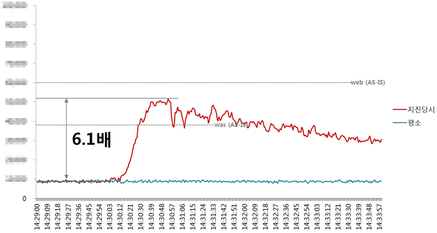

[그림 1] 포항 지진 당시 네이버 메인 페이지의 트래픽 변화

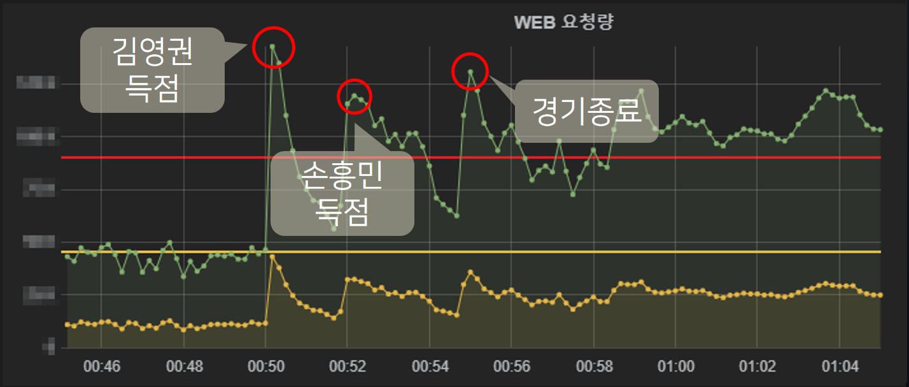

[그림 2] 2018 러시아 월드컵에서 한국과 독일의 경기 당시 네이버 메인 페이지의 트래픽 변화

## 급격한 트래픽 변화에 따른 대처방법 네이버의 대처를 중심으로

- 많은 사람의 주목을 받는 일이 있으면 트래픽의 변동도 커지게 됨.
- 네이버 메인 개발팀은 분산 처리와 모니터링 체계 등에서 다양한 노력을 진행하고 있음.

## 로드밸런서와 3계층 분산처리 모델 도식

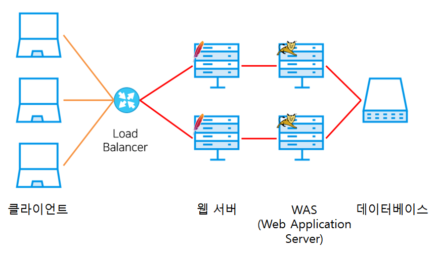

[그림 3] 로드밸런서와 3계층 분산처리 모델

- 클라이언트의 트래픽이 로드 밸런서를 통해 각 웹 서버로 분산된다. WAS는 동일한 데이터베이스를 참조한다.

#### [참고] 3계층 구조(3 Tier Architecture / 3 티어 아키텍처)

- 플랫폼을 3계층으로 나누어 별도의 논리적/물리적인 장치에 구축 및 운영하는 형태
  - 1계층 : 사용자가 직접 마주하는 프레젠테이션 계층(프론트엔드)
  - 2계층 : 데이터를 처리, 가공하는 비즈니스 로직 계층(백엔드)
  - 3계층 : 데이터를 읽고 쓰는 데이터 계층(데이터계층 또는 백엔드)

## 분산 처리 환경에서의 문제 발생 및 해결 방법

> 로드 밸런서를 사용하는 일반적인 3계층(3-Tier) 분산 처리 모델은 구성 요소에 문제가 생겼을 때 문제를 해결하기에 어려움이 있음.
> 따라서 서비스 특성과 요구 사항에 맞는 분산 처리 모델을 구축해 적용할 필요가 있음.

1. 로드밸런서

- 로드 밸런서에 문제가 생기면 로드 밸런서를 다중화한 다음 DNS 라운드로빈 방식 등을 적용해 문제를 처리

#### [참고] DNS 라운드로빈 방식

- 라운드 로빈(Round Robin Method)은 클라이언트로부터 받은 요청을 로드밸런싱 대상 서버에 순서대로 할당받는 방식

2. WAS

- WAS에 문제가 생겼을 때 웹 서버가 다른 WAS를 찾도록 설정
- 사용자가 로그인한 상태라면 WAS에 세션 클러스터링을 설정
- 세션 클러스터링 설정을 위한 추가 작업이 필요하고 관리 지점이 증가

#### [참고] 세션 클러스터링(Session Clustering)

- 세션 데이터를 여러개의 부분집합 (clusters) 으로 분할
- 세션 클러스터링은 2대 이상의 WAS 또는 서버를 사용할 때 로드 밸런싱, 장애 대비를 위해 세션을 **공유**

3. 데이터베이스

- 데이터 동기화 등의 문제 때문에 데이터 스토리지 레이어는 다중화가 특히 어려운 부분에 속한다.
- 사용하는 데이터베이스가 RDB라면 다중화를 어떻게 할 것인지, 데이터를 어떻게 분산할 것인지에 관해 깊이 고민해야 한다.
  - 예를 들어 샤딩(sharding) 등을 도입했을 때 데이터가 늘어나 샤드를 추가해야 한다면 기존 데이터의 마이그레이션은 어떻게 할지.
  #### [참고] 샤딩(sharding)
  - 하나의 거대한 데이터베이스나 네트워크 시스템을 여러 개의 작은 조각으로 나누어 분산 저장하여 관리
  - 샤딩을 통해 나누어진 블록들의 구간(Epoch)을 샤드(Shard)라고 부름.
  #### [참고] 다중화
  - 같은 시스템을 가진 - 예비장치 - 여러개를 준비해 시스템 일부에 장애가 발생해도 서비스를 계속 유지할 수 있도록 하는 것
- 사용하는 데이터베이스가 NoSQL이라면 데이터 정합성, 동기화, 장애 복구 시 데이터 오염 가능성 등을 고려해야 한다.

### 네이버의 분산처리 모델

[요구사항]

- 어떤 서버로 접속해도 동일한 내용을 보여 주어야 하며, 특정 상탯값(사용자의 로그인 여부 등)에 의존하지 말아야 한다.
- 무슨 일이 있더라도 사용자에게 서비스가 제공되어야 한다.
  - 브라우저에 빈 페이지가 나타나지 않아야 한다.
  - 네이버 메인 페이지에서 연동하는 외부 시스템은 언제든 접속이 불안해질 가능성이 있다고 가정하고 빠른 실패 전략을 실행해야 한다.
- 트래픽 증가에 탄력적으로 대처할 수 있어야 한다.
  - 트래픽이 폭주할 때 서버 증설만으로도 대응할 수 있어야 한다.
  - 각 컴포넌트(웹 서버, WAS)의 효율성을 극대화할 수 있어야 한다

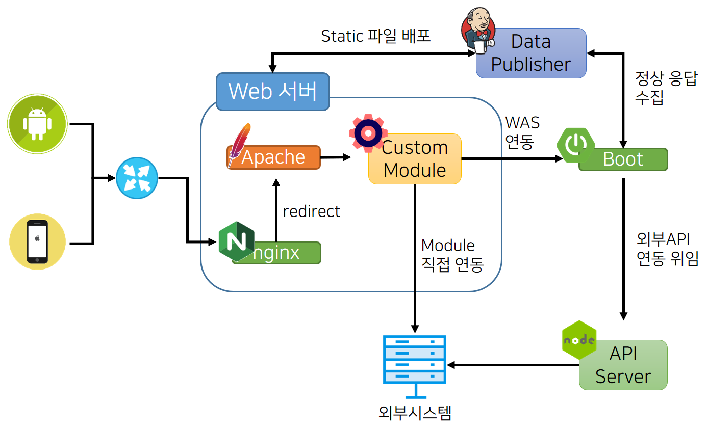

[그림 4] 네이버 메인 페이지의 분산 처리 모델

### 네이버 페이지의 분산처리 기술

- GCDN(Global CDN)
- SSI(Server Side Includes)
- Apache 커스텀 모듈
- 마이크로서비스(부분 도입)
  - 서킷 브레이커(circuit breaker)
  - 서비스 디스커버리(service discovery)

### GCDN(Global Content Delivery Network)

- CSS와 JavaScript, 이미지와 같이 공통으로 호출되는 리소스는 한 번 업로드되면 잘 변하지 않는다.
- 이런 리소스를 네이버 메인 페이지의 웹 서버에서 직접 제공하면 트래픽 부하가 엄청나게 가중된다.
- 예를 들어 100KB 용량의 이미지를 10만 명이 조회하면 대략 10GB의 트래픽이 발생한다.
- 공통적으로 호출되는 리소스의 부하 분산을 위해 GCDN을 사용
- 리소스를 GCDN으로 분산하면 네이버 메인 페이지의 트래픽을 상당히 절감
- GCDN에서 지원하는 GSLB(Global Server LB) 기능은 접속한 IP 주소에서 가장 가까운 CDN 서버를 자동으로 선정해 연결하므로 사용자가 빠른 서비스 속도를 체감할 수 있다.

### SSI(Server Side Include)

- SSI는 웹 서버(Apache, NGINX 등)에서 지원하는 서버사이드 스크립트 언어
- 서버에 있는 특정 파일을 읽어오거나 특정 쿠키 유무의 판별 등 간단한 기능을 실행할 수 있다.
- 이런 기능을 WAS에서만 실행할 수 있다고 생각하고 WAS에 요청을 보내는 경우가 많다.
- 하지만 SSI를 사용해 웹 서버에서 기능을 처리하면 WAS의 부담을 줄여 WAS의 성능이 좋아짐.
- 웹 서버의 활용도도 높여 서버의 자원을 더 효율적으로 사용할 수 있다.
  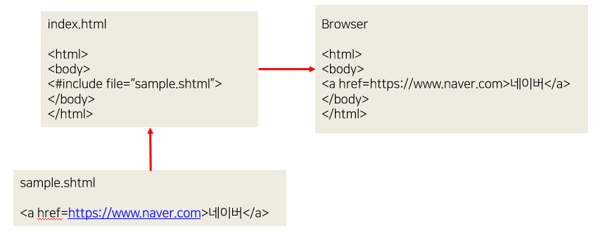

[그림 5] SSI 처리 방식

#### 사진에 포함된 SSI 지시자

- #include : 다른 파일을 이 파일 내부로 불러들임

### 서킷 브레이커(Circuit Breaker)

- 단어 의미 : 회로 차단
- 서킷 브레이커는 외부 서비스의 장애로 인한 연쇄적 장애 전파를 막기 위해 자동으로 외부 서비스와 연결을 차단 및 복구에 사용됨.
- 서킷 브레이커를 사용하는 목적은 애플리케이션의 안정성과 장애 저항력을 높이는 데 있음
- 분산 환경에서는 네트워크 일시 단절 또는 트래픽 폭증으로 인한 간헐적 시간 초과 등의 상황이 종종 발생
- 일시적인 경우라면 2, 3회 재시도로 정상 데이터를 수신할 수 있다. 하지만 장애 상황이라면 계속 재시도하는 것이 의미도 없을 뿐 아니라 외부 서비스의 장애 복구에 악영향을 미칠 수 있음
- 미리 준비된 응답을 사용자에게 전달
- 서킷 상태 변화를 체크함

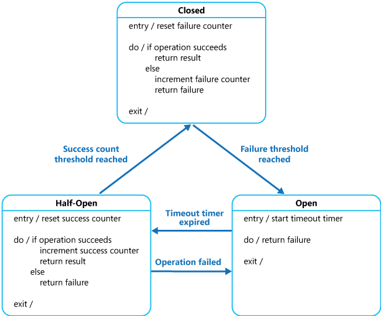

[그림 6] 서킷 브레이커에서 서킷의 상태 변화(원본 출처: Circuit Breaker pattern)

#### [참고] 서킷 브레이커 상태

- 서킷은 다음과 같은 세 가지 상태를 가짐(회로이므로 닫힌 것이 정상, 열린 것이 비정상).
  - Closed 상태: 메서드가 정상적으로 작동해 서킷이 닫힌 상태
  - Open 상태: 메서드에 문제가 생겨서 서킷이 열린 상태
  - Half-Open 상태: Open 상태와 Closed 상태의 중간 상태. 메서드를 주기적으로 확인해 정상이라고 판단되면 Closed 상태로 상태를 전환하고, 정상이 아니라면 Open 상태를 유지한다.
- 서킷 브레이커 메커니즘
  - 서킷이 Closed 상태에서 잘 작동하고 있다가 오류가 발생하기 시작해서 일정 횟수에 도달하면 일단 서킷을 Open 상태로 전환한다.
  - 이때는 메서드를 호출해도 실제로 메서드가 실행되는 대신 서킷 브레이커가 개입해 미리 지정된 응답(단순 실패를 반환할 수도 있고 특정한 값을 반환할 수도 있음)을 반환한다.
  - 기존에는 이런 로직을 구현하기 위해 개발자가 수많은 if-else 구문을 작성해야 했지만, Netflix OSS의 서킷 브레이커 라이브러리인 Netflix OSS Hystrix가 등장한 이후 많은 개발자가 Netflix OSS Hystrix를 적극적으로 사용하고 있음.
  - Netflix OSS를 Spring Cloud 프로젝트에서 사용할 수 있도록 래핑한 Spring Cloud Netflix를 활용하면 Spring 개발자는 자신의 애플리케이션에서 서킷 브레이커를 손쉽게 활용할 수 있음.

### 서비스 디스커버리(Service Discovery)

- 서비스 디스커버리는 동적으로 생성, 삭제되는 서버 인스턴스에 대한 IP 주소와 포트를 자동으로 찾아 설정할 수 있게 하는 기능
- 서버군 2에서 10.0.0.5 서버가 신규로 생성됐지만, 서버군 1에서는 10.0.0.5 서버로 연결을 맺을 수 없다.
- 서버군 1이 최초에 실행됐을 때에는 10.0.0.5 서버가 없었기 때문에 서버 목록에 10.0.0.5 서버가 없기 때문이다.
- 서버 목록을 갱신하려면 서버군 1에 있는 서버를 다시 실행해야 한다.
- 하지만 롤링 리스타트를 한다고 해도 서비스를 운영하는 도중에 서버를 다시 실행하는 것은 매우 위험하므로 이때 서비스 디스커버리 도입이 필요하게 된다.
  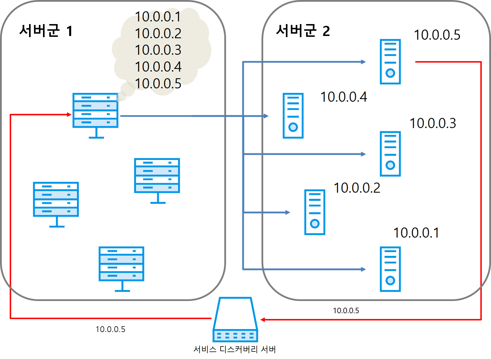

[그림 7] 서비스 디스커버리를 사용하는 환경

### 성능 지표 수집과 모니터링

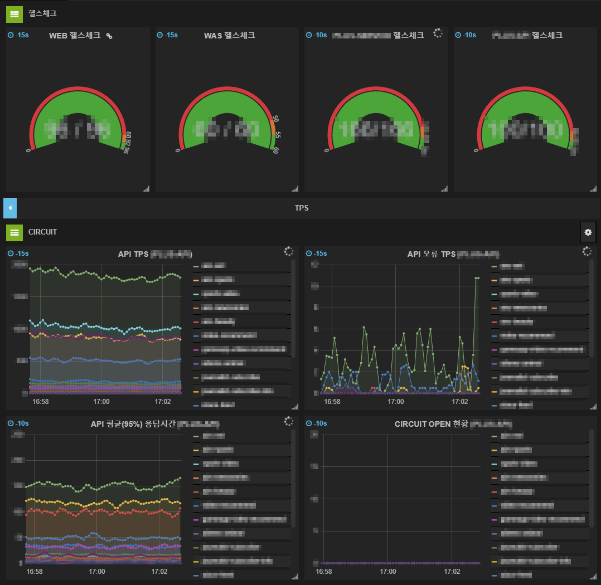

[그림 8] NPOT의 모니터링 화면

- NPOT을 위한 성능 지표는 Spring Boot 기반의 애플리케이션인 Spring Boot Actuator의 MetricWriter를 활용해 수집

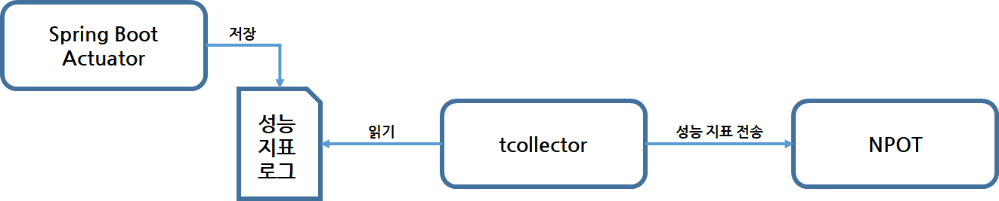

[그림 9] 네이버 메인 페이지의 성능 지표 수집

- 수집된 성능 지표는 다음과 같은 로그 파일 형태로 저장된다. 이 로그 파일을 읽어 NPOT에 전송해 성능 지표를 시각화
  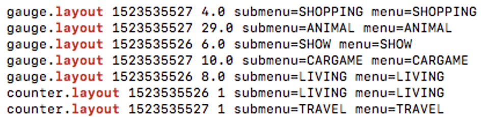

[그림 10] 성능 지표 데이터의 예

### 비상 대응 체계(MEERCAT Application)

- MEERCAT이라는 애플리케이션을 개발해서 애플리케이션이 스스로 트래픽을 예측해 갑작스러운 트래픽 증가를 방어
- MEERCAT은 다음과 같은 두 가지 상황이 발생하면 자동으로 모든 외부 시스템과 연결을 끊고 자체 서버로만 서비스를 제공하는 방어 동작을 실행
  - 실시간으로 트래픽을 수집하고 그 양상을 예측한 다음 트래픽 폭증이 예측되는 경우
  - 기상청의 지진 발생 신호 등 외부 신호가 수신되는 경우
- 방어 동작은 네이버 메인 페이지의 순간 성능 및 가용량을 향상시킴과 더불어 외부 시스템을 보호한다는 의미를 가짐.

- MEERCAT이 트래픽 이상을 감지해 처리하는 과정을 나타낸 흐름도
  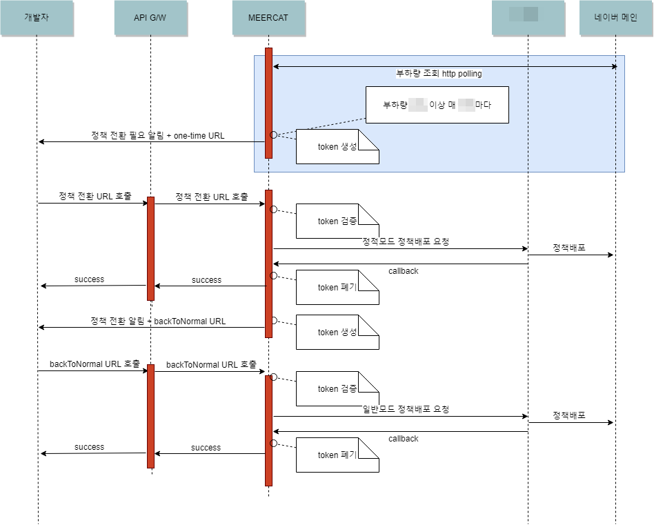

[그림 11] 트래픽 이상 감지 시 처리 흐름

- MEERCAT에 외부 신호가 수신됐을 때 처리 과정을 나타낸 흐름도
  - 기상청의 지진 발생 신호 등 외부의 신호가 수신되면 자동으로 방어 동작을 실행
    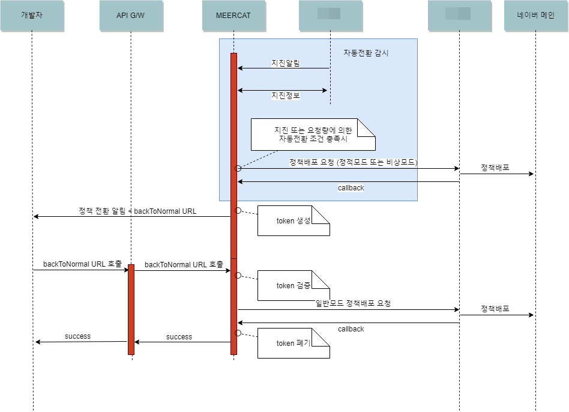

[그림 12] 지진 등 외부 신호 수신 시 처리 흐름

- MEERCAT이 실제 방어 동작을 실행한 예
- 네이버 메인 페이지의 트래픽이 일정 시간 뒤에 한계치에 도달할 것으로 예측해 외부 시스템 연동을 자동으로 끊는 방어 동작(비상I모드)을 실행함.
- 스스로 방어 동작을 실행해 연쇄 장애를 사전에 차단(사무실 상주 인력이 없음에도 앱 자동화를 통해 수행가능)
  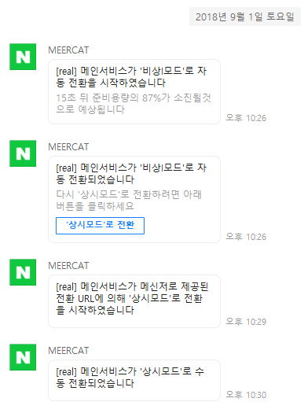

[그림 13] MEERCAT 앱 자동화 처리

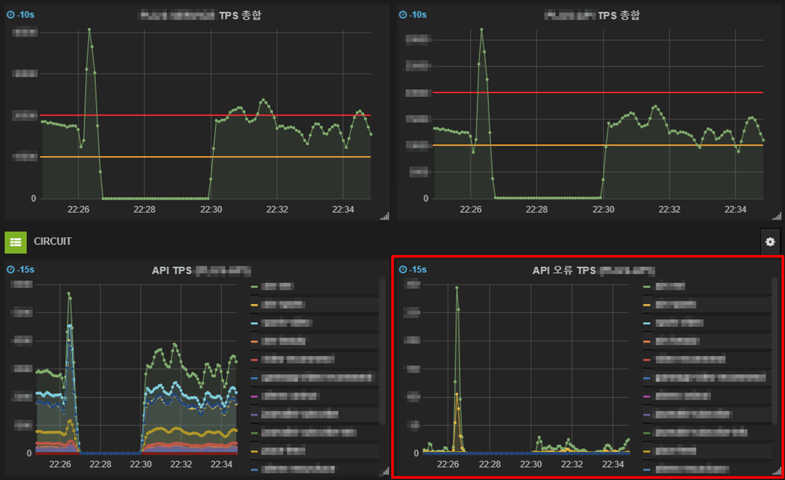

[그림 14] MEERCAT이 방어 동작을 실행할 때의 트래픽 상황

- [API 오류 TPS] MEERCAT이 자동으로 연결을 끊기 전에 오류 건수가 급증한 것을 볼 수 있음.
- 이대로 트래픽이 아무런 제어 없이 계속 외부 시스템으로 흘러갔다면 외부 시스템의 연쇄 장애가 일어났을 가능성이 큼.
- 하지만 MEERCAT이 정확히 작동해 자동으로 연결을 끊어 연쇄 장애를 막을 수 있었음.
- 연결 복구 이후 오류 TPS가 확연히 낮아진 것을 볼 수 있음.

### 마치며

- 무슨 일이 있더라도 사용자에게 서비스가 제공될 수 있게 서버를 운영하여야 한다는 것을 알게 되었음.
- 트래픽 폭증이나 외부 재해가 일어났을 때도 서비스가 안정적으로 이루어질 수 있게 모니터링 체계와 비상 대응 체계 기반을 갖춤으로써 서버 관리 시스템에서 불필요한 인력을 배치하지 않고 서버가 원활하게 운영될 수 있게 운영할 수도 있다는 것을 알게 되었음.
- 각 계층의 요소의 효율성을 극대화 한다는 측면에서 트래픽 이상 감지 서비스를 위한 많은 노력이 이뤄지고 있음을 알 수 있었음.

## 참고 자료

- https://ko.wikipedia.org/wiki/웹_트래픽
- https://d2.naver.com/helloworld/6070967
- https://www.stevenjlee.net/2020/05/08/%EC%9D%B4%ED%95%B4%ED%95%98%EA%B8%B0-3%EA%B3%84%EC%B8%B5-%EA%B5%AC%EC%A1%B0-3-tier-architecture/
- https://sasca37.tistory.com/271
- https://dev.classmethod.jp/articles/load-balancing-types-and-algorithm/#toc-7
